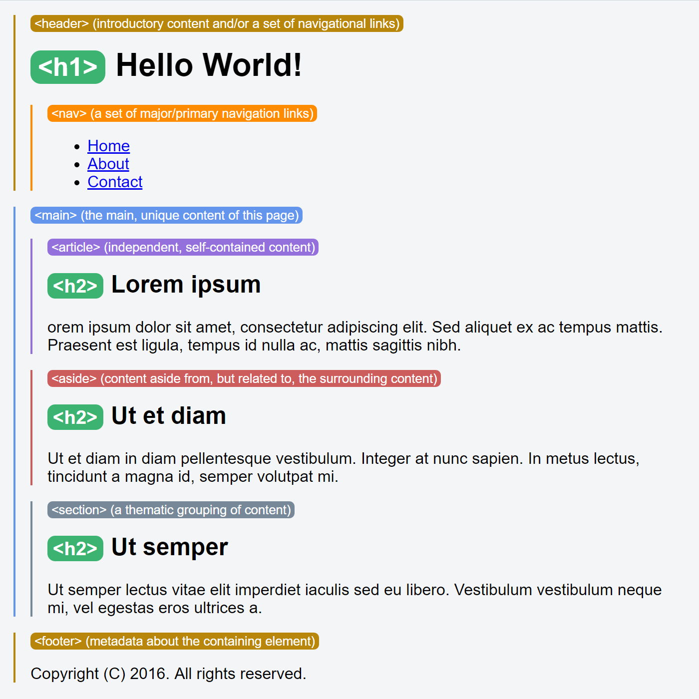

# h5h

An HTML5 highlighter.

A [CSS](https://en.wikipedia.org/wiki/Cascading_Style_Sheets) file which highlights the [HTML5 semantic elements](http://www.w3schools.com/html/html5_semantic_elements.asp) in your web page. [See it in action](https://jsfiddle.net/adamralph/x5kjy8ag/4/).



## How to use

Add the CSS file to your website and link to it in your HTML `<HEAD>` element as you would any other. For best results, link to h5h after all other stylesheet links or inline styling.

- [h5h-n.css](https://raw.githubusercontent.com/adamralph/h5h/master/h5h-n.css) - normalising version (recommended)
  ```html
  <link rel="stylesheet" href="css/h5h-n.css" />
  ```

- [h5h.css](https://raw.githubusercontent.com/adamralph/h5h/master/h5h.css) - bare-bones version
  ```html
  <link rel="stylesheet" href="css/h5h.css" />
  ```

For convenience, the normalising version of h5h includes Nicolas Gallagher's excellent [Normalize.css](https://necolas.github.io/normalize.css/) which normalises all previously applied styles to give you a simple, un-styled view of your HTML5 semantic elements. If you prefer to manage previously applied styling yourself, use the bare-bones version.

A good way to use h5h is to keep a link to it in your HTML at all times, but commented out. Un-comment the link when you want to check your HTML5 semantics.

## Try it on a live web page!

It's also possible to apply h5h to a live web page, using your browser and one of the many browser extensions that allow tampering with CSS.

For example, using Chris Pederick's excellent [Web Developer extension](http://chrispederick.com/work/web-developer/), under "CSS", click "Disable All Styles", then click "Edit CSS" and then in of the tabs in the "Edit CSS" frame which appears at the bottom of the page, paste in the contents of [the normalising version of h5h](https://github.com/adamralph/h5h/blob/master/h5h-n.css). Here's what that looks like when applied to the [HTML5 Doctor home page](http://html5doctor.com/).


## Currently highlighted elements

| Element        | Highlighted? |
|----------------|--------------|
| `<article>`    | **yes**      |
| `<aside>`      | **yes**      |
| `<details>`    | no           |
| `<figcaption>` | no           |
| `<figure>`     | no           |
| `<footer>`     | **yes**      |
| `<header>`     | **yes**      |
| `<main>`       | **yes**      |
| `<mark>`       | no           |
| `<nav>`        | **yes**      |
| `<section>`    | **yes**      |
| `<summary>`    | no           |
| `<time>`       | no           |

Appropriate support for the remaining elements will be added in future versions. (Hint: pull requests are welcome.) :wink:

In addition, h5h highlights the `<h1>` to `<h6>` elements as an aid to judging how your page stands up to [the theory vs. the reality of HTML5 outlining](http://html5doctor.com/computer-says-no-to-html5-document-outline/).

h5h also restricts the size of `<p>` and `` elements to prevent them over-interfering with the semantic view.

---

<sub>[Highlighter](https://thenounproject.com/term/target/127693) by [ Creative Stall](https://thenounproject.com/creativestall/) from [the Noun Project](https://thenounproject.com/).</sub>
